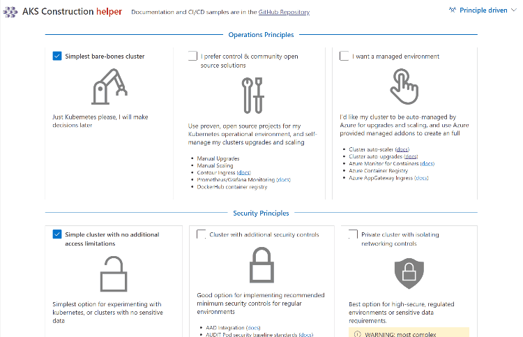
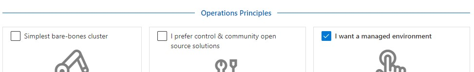
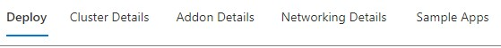
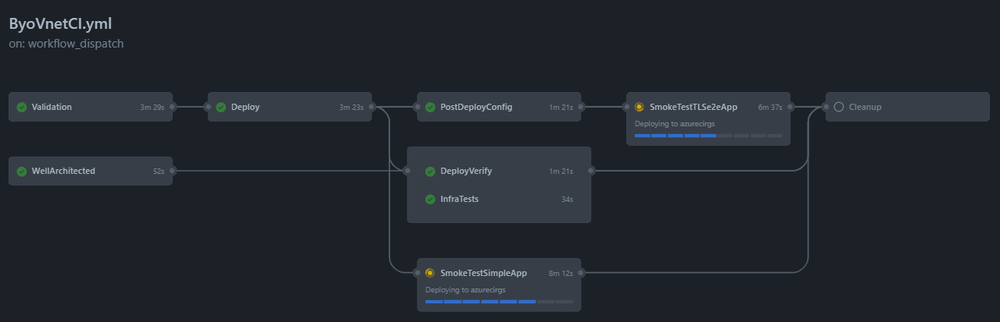

# AKS Accelerator

Building a complete Kubernetes operational environment is hard work! __AKS Accelerator__ dramatically speeds up this work by providing the templates and deployment scripts to quickly create a  __fully configured__, Kubernetes environment, tailored to meet your operational and security needs, ready to run your workloads in production.

## QuickStart

* #### **Step 1**
  Navigate to the AKS Construction [**helper**](https://azure.github.io/AKS-Construction/)

* #### **Step 2** Select your Requirements (optional)
  Select your base `Operational` and `Security` Principles using the presets that have been designed from our field experience

  
   
  > **Note**
  > If following Azure's **Landing Zone** methodology, select `Enterprise Scale` from the dropdown, then select your environment type

* #### **Step 3** Fine tune (optional)
  Use the tabs to fine tune your cluster requirements

  
* #### **Step 4** Deploy
  In the `Deploy` tab, choose how you will deploy your new cluster, and follow the instructions

  

## Advanced Scenarios

The QuickStart provides a nice easy way of creating your AKS Environment, once you've done this it's likely you'll want to consume AKS Construction in a more [advanced scenario](docs/AdvancedUsage.md).

## Project components

### Helper

The Helper is a website that provides a guided experience to creating your AKS environment. It dynamically generates the parameters to call the IaC, and provides deployment options using the Azure CLI, GitHub Actions or Terraform.

### IaC - Bicep code files

IaC (Infrastructure as Code) code files have been modularised into their component areas. [Main.bicep](bicep/main.bicep) references them and they are expected to be present in the same directory. The Deployment Helper leverages an Arm json compiled version of all the bicep files.

Releases are used to version the bicep code files, they can be leveraged directly for use in your project or you can opt to Fork the repo if you prefer.

### DevOps - GitHub Actions

A number of [GitHub actions](https://github.com/Azure/AKS-Construction/tree/main/.github/workflows) are used in the repo that run on push/pr/schedules. These can be copied into your own repo and customised for your CI/CD pipeline. A robust deployment pipeline is essential when coordinating the deployment of multiple Azure services that work together, additionally there is configuration that cannot be set in the template and that needs to be automated (and tested) consistently.

CI Name | Actions Workflow | Parameter file | CI Status | Notes
|--------|--------|--------|-----------|------|
| Starter cluster | [StandardCI.yml](https://github.com/Azure/AKS-Construction/blob/main/.github/workflows/StandardCI.yml) | [ESLZ Sandbox](.github/workflows_dep/AksDeploy-Basic.parameters.json) |  | A simple deployment example, good for first time users of this project to start with  |
| BYO Vnet | [ByoVnetCI.yml](https://github.com/Azure/AKS-Construction/blob/main/.github/workflows/ByoVnetCI.yml) | [ESLZ Byo peered vnet](.github/workflows_dep/AksDeploy-ByoVnet.parameters.json) |  | Comprehensive IaC flow deploying multiple smoke-test apps |
| Private cluster | [ByoVnetPrivateCI.yml](https://github.com/Azure/Aks-Construction/blob/main/.github/workflows/ByoVnetPrivateCI.yml) | [ESLZ Byo private vnet](.github/workflows_dep/AksDeploy-ByoVnetPrivate.parameters.json) | | A private AKS cluster that deploys a vnet with private link services. |

For a more in depth look at the GitHub Actions used in this project, which steps are performed and the different CI practices they demonstrate, please refer to [this page](docs/GhActions.md).

## Background

This project unifies guidance provided by the [AKS Secure Baseline](https://docs.microsoft.com/azure/architecture/reference-architectures/containers/aks/secure-baseline-aks), [Well Architected Framework](https://docs.microsoft.com/azure/architecture/framework/), [Cloud Adoption Framework](https://azure.microsoft.com/cloud-adoption-framework/) and [Enterprise-Scale](https://github.com/Azure/Enterprise-Scale) by providing tangible artifacts to deploy Azure resources from CLI or CI/CD systems.

This project is part of the official [AKS Landing Zone Accelerator (Enterprise Scale)](https://github.com/Azure/AKS-Landing-Zone-Accelerator) architectural approach. To read more about this project and how the it fits with Enterprise Scale and the AKS Secure Baseline, look [here](referencearchs.md).

## Project Principals

The guiding principal we have with this project is to focus on the the *downstream use* of the project (see [releases](https://github.com/Azure/AKS-Construction/releases)). As such, these are our specific practices.

1. Deploy all components through a single, modular, idempotent bicep template Converge on a single bicep template, which can easily be consumed as a module
2. Provide best-practice defaults, then use parameters for different environment deployments
3. Minimise "manual" steps for ease of automation
4. Maintain quality through validation & CI/CD pipelines that also serve as working samples/docs
5. Focus on AKS and supporting services, linking to other repos to solve; Demo apps / Developer workstations / Jumpboxes / CI Build Agents / Certificate Authorities

## Contributing

If you're interested in contributing, we have two contribution guides in the repo which you should read first.

Guide | Description
----- | -----------
[Generic Contribution Guide](CONTRIBUTING.md) | Talks about the branching strategy, using CodeSpaces and general guidance
[Helper Contribution Guide](https://github.com/Azure/AKS-Construction/blob/main/docs/ContributingHelper.md) | Talks about the structure of the app and walks through a sample change of adding a new feature to the UI and Bicep

This project welcomes contributions and suggestions.  Most contributions require you to agree to a
Contributor License Agreement (CLA) declaring that you have the right to, and actually do, grant us
the rights to use your contribution. For details, visit https://cla.opensource.microsoft.com.

When you submit a pull request, a CLA bot will automatically determine whether you need to provide
a CLA and decorate the PR appropriately (e.g., status check, comment). Simply follow the instructions
provided by the bot. You will only need to do this once across all repos using our CLA.

This project has adopted the [Microsoft Open Source Code of Conduct](https://opensource.microsoft.com/codeofconduct/).
For more information see the [Code of Conduct FAQ](https://opensource.microsoft.com/codeofconduct/faq/) or
contact [opencode@microsoft.com](mailto:opencode@microsoft.com) with any additional questions or comments.

## FAQ / Troubleshooting

### Subscription is not registered to use namespace Microsoft.OperationsManagement

Azure Subscriptions use resource providers to be able to create Azure Services. Sometimes it can be the case that core RP's are not properly registered in your subscription. Take time to read the error message, and follow the steps to resolve. [https://docs.microsoft.com/azure/azure-resource-manager/troubleshooting/error-register-resource-provider?tabs=azure-cli](https://docs.microsoft.com/azure/azure-resource-manager/troubleshooting/error-register-resource-provider?tabs=azure-cli)

## Trademarks

This project may contain trademarks or logos for projects, products, or services. Authorized use of Microsoft
trademarks or logos is subject to and must follow
[Microsoft's Trademark & Brand Guidelines](https://www.microsoft.com/en-us/legal/intellectualproperty/trademarks/usage/general).
Use of Microsoft trademarks or logos in modified versions of this project must not cause confusion or imply Microsoft sponsorship.
Any use of third-party trademarks or logos are subject to those third-party's policies.
