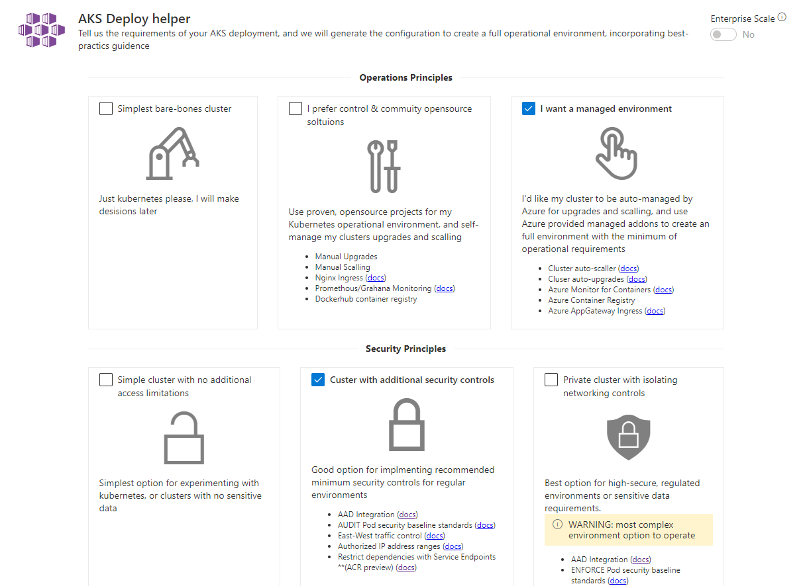
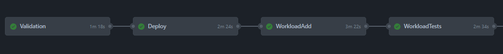

# AKS Bicep Accelerator

This project provides a comprehensive, flexible templating approach to creating Azure Kubernetes Service clusters and related Azure services.
It unifies guidance provided by the [AKS Secure Baseline](https://docs.microsoft.com/en-us/azure/architecture/reference-architectures/containers/aks/secure-baseline-aks), [Cloud Adoption Framework](https://azure.microsoft.com/en-gb/cloud-adoption-framework/) and [Enterprise-Scale](https://github.com/Azure/Enterprise-Scale) by providing tangible artifacts to deploy Azure resources from CLI or CI/CD systems.

## The 3 Components

### Wizard experience

To help guide your AKS configuration, use the [Deployment Helper](https://azure.github.io/Aks-Construction/), which will provide a set of parameters and scripts to make deployment simple. The deployment helper provides links to the official Microsoft documentation to help provide additional context for each feature.

### IaC - Bicep code files

IaC (Infrastructure as Code) code files have been modularised into their component areas. [Main.bicep](bicep/main.bicep) references them and they are expected to be present in the same directory. The Deployment Helper leverages an Arm json compiled version of all the bicep files.

### DevOps - GitHub Actions

A number of [GitHub actions](https://github.com/Azure/Aks-Construction/tree/main/.github/workflows) are used in the repo that run on push/pr/schedules. These can be copied into your own repo and customised for your CI/CD pipeline. A robust deployment pipeline is essential when coordinating the deployment of multiple Azure services that work together, additionally there is configuration that cannot be set in the template and that needs to be automated (and tested) consistently. 

CI Name | Parameter file | CI Status | Notes
|--------|--------|-----------|------|
| BYO Vnet | [ESLZ Byo peered vnet](.github/workflows_dep/AksDeploy-ByoVnet.parameters.json) |  | Takes full resource id's as parameters for existing subnets |
| Private cluster | [ESLZ Byo private vnet](.github/workflows_dep/AksDeploy-ByoVnetPrivate.parameters.json) | | as per ByoVnet, but Private |
| Basic cluster | [ESLZ Sandbox](.github/workflows_dep/AksDeploy-Basic.parameters.json) |  | Deploys it's own network using default CIDRs |

For a more in depth look at the GitHub Actions used in this project, which steps are performed and the different CI practices they demonstrate, please refer to [this page](GhActions.md).

## Getting Started

### Basic

If this is the first time you're using the project, follow these steps.

1. Use the [Deployment Helper](https://azure.github.io/Aks-Construction/) to guide your AKS configuration. 
1. Run the commands in the *Provision Environment* tab to create your AKS Environment in your Azure subscription
1. Run the commands in the *Post Configuration* tab to complete your implementation
1. [Connect to your AKS Cluster](https://docs.microsoft.com/en-us/azure/aks/kubernetes-walkthrough#connect-to-the-cluster), and deploy your applications as you see fit.

### Mature

If you're looking to use this project as part of your deployments, follow these steps.

1. Use the [Deployment Helper](https://azure.github.io/Aks-Construction/) to guide your AKS configuration. 
1. Capture the parameters on the *Template Parameters File* tab to a file - this is your configuration
1. Check the *Post Configuration* tab for any commands and save them to a file
1. Grab the [latest release](https://github.com/Azure/Aks-Construction/releases) of the bicep code
1. (optionally) Author an Application Main bicep to represent *your application* (see [here](https://github.com/Azure/Aks-Construction/blob/main/samples/SampleAppMain.bicep) for an example)
1. In your CI/CD system, either using one of the GitHub Action Workflow files as a base, or by coding it yourself - initiate a deployment of the bicep code, using your parameter file
1. In your CI/CD system, deploy your application(s) to the AKS cluster

## Project Principals

The guiding principal we have with this project is to focus on the the *downstream use* of the project (see [releases](https://github.com/Azure/Aks-Construction/releases)). As such, these are our specific practices.
1. Deploy all components through a single, modular, itempotent bicep template Converge on a single bicep template, which can easily be consumed as a module
2. Provide best-practice defaults, then use parameters for different environment deployments
3. Minimise "manual" steps for ease of automation
4. Maintain quality through validation & CI/CD pipelines that also serve as working samples/docs
5. Focus on AKS and supporting services, linking to other repos to solve; Demo apps / Developer workstations / Jumpboxes / CI Build Agents / Certificate Authorities

## Contributing

If you're interested in contributing, please refer to the [contribution guide](CONTRIBUTE.md)

This project welcomes contributions and suggestions.  Most contributions require you to agree to a
Contributor License Agreement (CLA) declaring that you have the right to, and actually do, grant us
the rights to use your contribution. For details, visit https://cla.opensource.microsoft.com.

When you submit a pull request, a CLA bot will automatically determine whether you need to provide
a CLA and decorate the PR appropriately (e.g., status check, comment). Simply follow the instructions
provided by the bot. You will only need to do this once across all repos using our CLA.

This project has adopted the [Microsoft Open Source Code of Conduct](https://opensource.microsoft.com/codeofconduct/).
For more information see the [Code of Conduct FAQ](https://opensource.microsoft.com/codeofconduct/faq/) or
contact [opencode@microsoft.com](mailto:opencode@microsoft.com) with any additional questions or comments.

## Trademarks

This project may contain trademarks or logos for projects, products, or services. Authorized use of Microsoft 
trademarks or logos is subject to and must follow 
[Microsoft's Trademark & Brand Guidelines](https://www.microsoft.com/en-us/legal/intellectualproperty/trademarks/usage/general).
Use of Microsoft trademarks or logos in modified versions of this project must not cause confusion or imply Microsoft sponsorship.
Any use of third-party trademarks or logos are subject to those third-party's policies.
