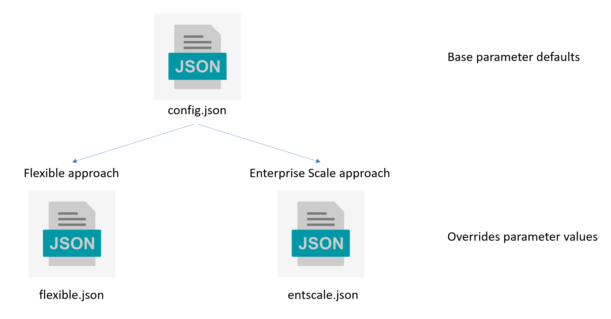
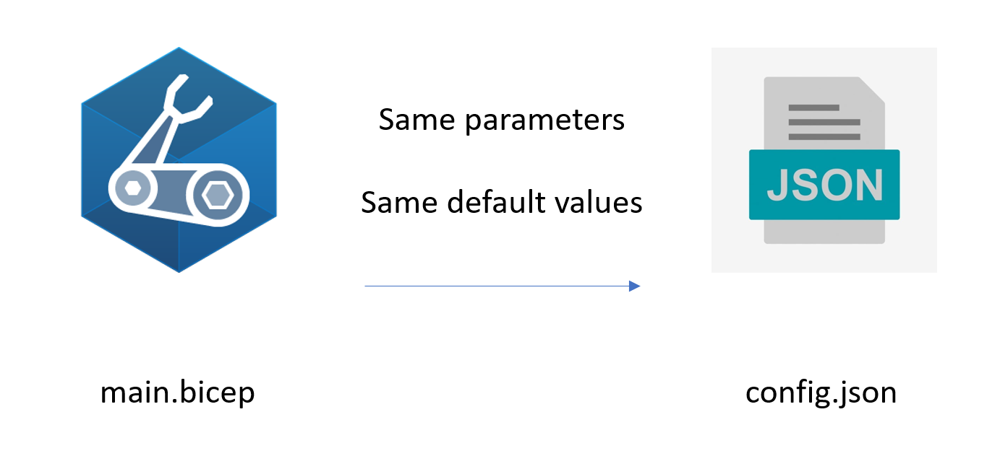
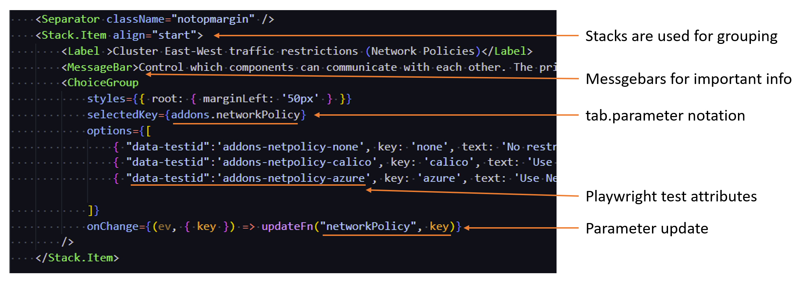
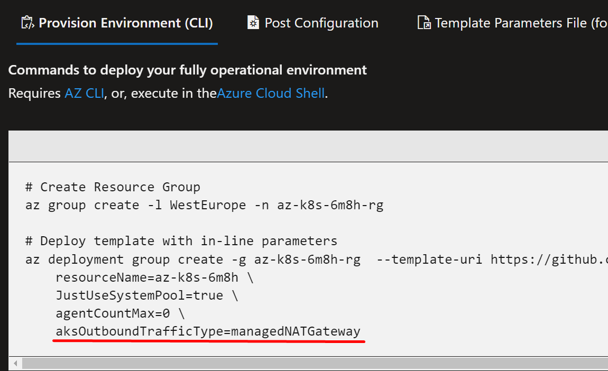

# Wizard

This guide shows how Wizard Web UI is structured, and walks through the approach for making changes.

> Not every addition to the bicep will need representation in the Wizard Web UI - but we find that most will.

## Overview

### Presets

The web app is preset driven, different presets will change the values of the controls in the tabs. Most controls map directly to a parameter for the main.bicep code file.



### Guidance in the UI

Whilst not being a teaching resource, adding UI hints, validation and links to the Azure documentation are very important.

## Design/Dev Process

Adding a new parameter to the main.bicep file will require that a corresponding control/parameter are added to the UI. This allows the property to be easily configured by users of the Wizard Web UI, and not just available for users of the bicep file.

## 1. Which tab

It's important to know which tab the parameter belongs on, because this will dictate which file you'll be working on and the appropriate point in the object tree to add your default value.

1. Deploy
1. Cluster
1. AddOns
1. Networking
1. Sample Apps

## 2. Default value

Open the [default control config file](../helper/src/config.json), and locate the section corresponding to the tab (eg. Networking). Add a new key value pair, using the identical parameter name from the bicep and the **same default**.

> Choosing the least obtrusive default value is the generally the best tact.



## 3. What control

Depending on the type of the parameter, you might want to add a [FluentUI](https://developer.microsoft.com/fluentui#/controls/web) control like ChoiceGroup, DropDown, Checkbox etc.

There are plenty of samples of these controls being used throughout the codebase. Find an existing use of one of these controls and use it as your reference.

## 4. Adding the control

In the components directory there will be a page for the tab you need to work on.
Locate where is best for the parameter to be added, and paste in the code from Step 3.



### Warnings

Consider the impact of the parameter on the deployment, add a warning to the UI to highlight considerations for the user. These can be shown conditionally on the selection of specific control values.

```javascript
<MessageBar messageBarType={MessageBarType.warning}>A warning message.</MessageBar>
```

## 5. Deployment output

Now that the control is working as expected on the page, we need to make sure that it's going to be output in the places that show performing a deployment.

In deployTab.js there is a variable called `params` which needs to reference the new parameter. When adding your parameter to this object, check against the defaults as part of the logic - this way we're only adding parameters where they deviate away from the bicep defaults keeping the deployment scripts much tighter.

```javascript
    ...(net.networkPlugin !== defaults.net.networkPlugin && {networkPlugin: net.networkPlugin}),
```

### Preview features

If the feature you're adding is a Preview feature then we need to add this to a specific object so that it can easily be removed for users that can't use preview features in their environments. Instead of adding your parameter to the `params` variable, use the `preview_params` variable instead.

## 6. Test

Either locally or on Codespaces, it's time to fire the application up to make sure that your change works. For help getting the app running in codespaces/dev containers, see [this guidance](../CONTRIBUTING.md#commands).

Make sure that changing the option of your control has the desired effect on the created Deployment Script output in the "Provision Environment (CLI)" tab.



## 7. Presets

In the [configpresets](../helper/src/configpresets/) directory there are different Architectural Approach files which contain multiple configuration presets. It may be appropriate to add the new parameter to these presets to set a specific value for that preset.

## 8. UI Tests

It's recommended to add a Playwright test covering the scenarios for the control as appropriate. With complex logic, tests are mandatory.

The `data-testid` attribute should be set on your FluentUI controls for the Playwright tests to navigate the dom.

Tests can be as simple as checking the correct default is set, but provide much more value when verifying interaction between controls.

```javascript
const { test, expect } = require('@playwright/test');

test('networkpolicy-test-default-is-azure', async ({ page }) => {
  await page.goto('http://localhost:3000/AKS-Construction');

  // Click the 3rd Tab in the portal Navigation Pivot (addons)
  await page.click('[data-testid="portalnav-Pivot"] > button:nth-child(3)');

  // Expect azure network policy to be checked!
  expect (await page.isChecked('[data-testid="addons-netpolicy-azure"]')).toBeTruthy()
});
```

## Example

A simple example change to the UI is when the Flux Addon was added. The bicep change included one new boolean parameter, which the UI would need to also supply.

1. Flux is a managed addon, so the correct tab for the control to go on is the **AddOns** tab.
1. `config.json` The default value in the bicep is false (least obtrustive) needs to be replicated into this json object.
```json
"addons": {
    "fluxGitOpsAddon": false,
```

3. As a boolean, the most suitable control is a checkbox, of which there are many samples in the codebase.

4. `addonsTab.js` Customising the code with the correct description, parameter name and adding a messagebox to provide further context.

```javascript
<Separator className="notopmargin" />

<Stack.Item align="start">
    <Label required={true}>
        GitOps with Flux
        (<a target="_new" href="https://docs.microsoft.com/azure/azure-arc/kubernetes/conceptual-gitops-flux2">docs</a>)
    </Label>
    <MessageBar messageBarType={MessageBarType.info} styles={{ root: { marginBottom: '10px' } }}>
            Enabling this option installs Flux to the cluster, but it doesn't apply configuration.
            For samples of Flux configuration see <Link target="_target" href="https://github.com/Azure/AKS-Construction/tree/main/samples/flux">Flux samples</Link>
    </MessageBar>
    <Checkbox styles={{ root: { marginLeft: '50px' } }} inputProps={{ "data-testid": "addons-gitops-checkbox"}} checked={addons.fluxGitOpsAddon} onChange={(ev, v) => updateFn("fluxGitOpsAddon", v)} label="Install the Flux GitOps AddOn" />
</Stack.Item>
```

5. `deployTab.js` Adding the parameter to the deployment tab involves just having a basic check against the default to ensure we're not including it unnecessarily.

```javascript
...(addons.fluxGitOpsAddon !== defaults.addons.fluxGitOpsAddon && { fluxGitOpsAddon: addons.fluxGitOpsAddon})
```
