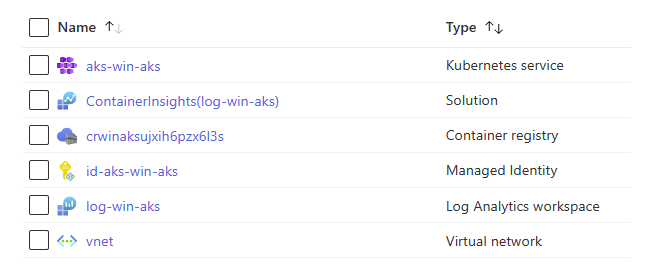
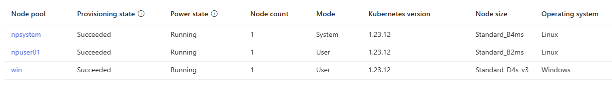

# Windows node pool example

This sample showcases using the AKS Construction bicep code for creating an AKS cluster with a **Windows** node pool.

A common configuration for Windows AKS Clusters is to use 3 nodepools. The Helper supports configuration for 2 nodepools, so we'll supplement the creation with an extra nodepool called from a parent bicep file.

- Creating Virtual Networks prior to AKS Cluster creation
- Creating an AKS Cluster with a linux system pool **and** a linux user nodepool (for ancilliary components like ingress controller)
- Extending the AKS config by creating additional autoscaling **Windows** node pools post creation

## Deploying the sample

```bash
az group create -n win-demo -l northeurope
az deployment group create -n win-demo -g win-demo -f ./samples/windows/main.bicep
```

### Inspecting the deployed resources



### Inspecting the created node pools



## Further Reading

- [Windows AKS Baseline](https://github.com/Azure/aks-baseline-windows)
- [Windows on AKS FAQ](https://learn.microsoft.com/azure/aks/windows-faq?tabs=azure-cli)
